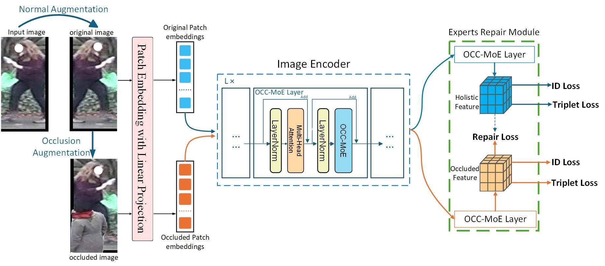

# occ-moe for Occluded Person Re-Identification

[](https://www.python.org/)
[](https://pytorch.org/)
[](LICENSE)

## 📖 Abstract

Person re-identification (ReID) is crucial for cross-camera target retrieval, yet it faces significant challenges due to occlusion. We introduce the Occlusion-Aware Mixture-of-Experts Vision Transformer (Occ-MoE), a dual-branch architecture that processes both original and occluded images. Occ-MoE incorporates an Occlusion-Aware Routing (OAR) mechanism and a Dual-Path Experts (DPE) module to emphasize robust identity-related features while suppressing occluded or non-pedestrian regions. Our Expert-based Restoration Module (ERM) facilitates dynamic interaction between occlusion stream features and predicted occlusion masks. Experiments on several benchmark datasets demonstrate superior ReID performance, improving both mean Average Precision (mAP) and Rank-1 accuracy, validating our design's effectiveness in mitigating feature corruption and performing occlusion feature recovery.

**Keywords**: Person Re-Identification, Vision Transformer, Mixture-of-Experts, Occlusion Handling, Computer Vision

## 🎯 Key Features

- **Mixture-of-Experts Architecture**: Dynamic routing mechanism for handling occluded regions
- **Occlusion-aware Learning**: Specialized experts for different occlusion patterns
- **State-of-the-Art Performance**: Superior results on occluded ReID benchmarks


### Qualitative Results


*Figure 1: Overall architecture of our MoE-ViT framework*


*Figure 2: Qualitative re-identification results on occluded scenarios*

## 🛠 Installation

### Requirements

- Python 3.9+
- PyTorch 1.7+
- torchvision
- Other dependencies

### Setup

```bash
# Clone this repository
git clone https://github.com/BestTao/occ-moe.git
cd occ-moe

# Install dependencies
pip install -r requirements.txt
